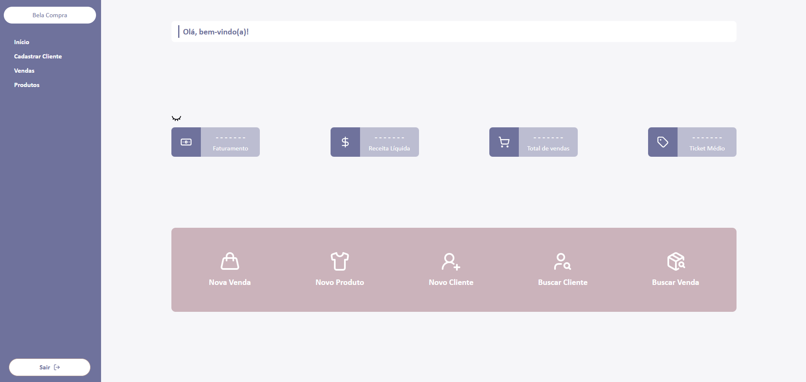
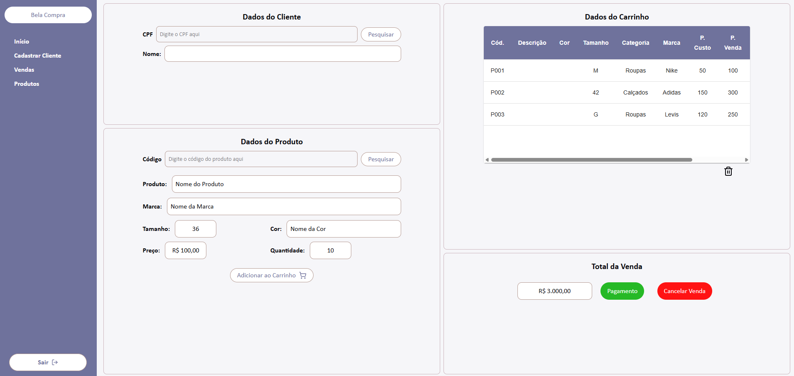

# Sistema de Loja de Roupas

Este projeto é um **sistema de loja de roupas**, desenvolvido para facilitar o gerenciamento de uma loja real. A ideia surgiu porque a loja da minha irmã precisava anotar tudo no caderno e depois procurar as informações, o que é muito trabalhoso.

---

## Tecnologias Utilizadas

- **Frontend:** React + TypeScript
- **Bibliotecas e Conceitos:**
  - React Hook Form
  - Axios para requisições HTTP
  - Componentização e criação de componentes genéricos
  - Custom Hooks para reutilização de lógica
- **Backend:** Inicialmente utilizando `json-server` para testes

---

## Funcionalidades

- Registro de clientes
- Cadastro de produtos
- Listagem de produtos com tabela genérica
- Requisições HTTP para buscar e salvar dados
- Componentes reutilizáveis e hooks customizados

- **Home Page**

**Registro de Cliente**

---

## Observações

Este sistema foi criado como um projeto de aprendizado e aplicação de conceitos de **React com TypeScript**, visando **componentização, reuso de código e boas práticas** no desenvolvimento frontend.

Em testes, o `json-server` está sendo utilizado como backend, mas futuramente será substituído por uma API real com Spring Boot e PostgreSQL.

---
